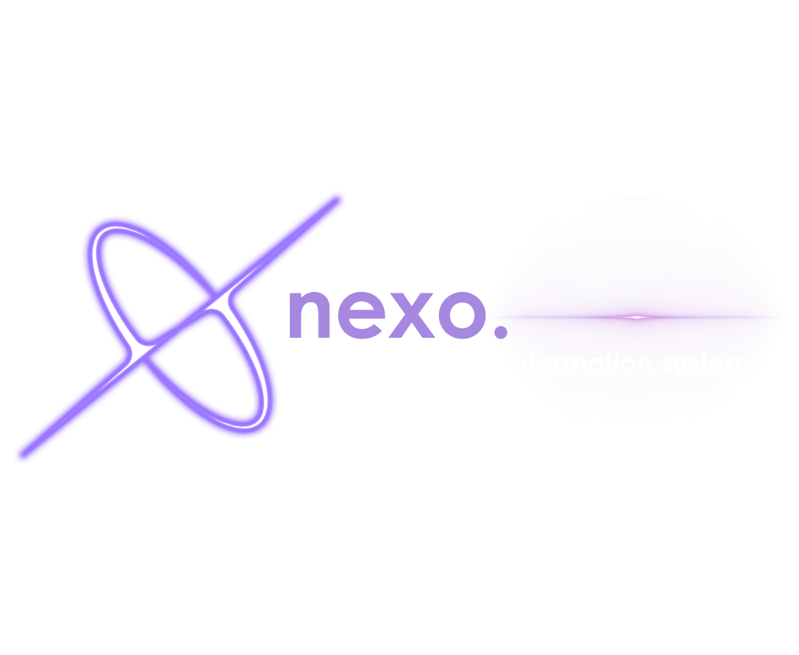

<p align="center">
  
</p>

<h1 align="center">nexo</h1>

<p align="center">
  <b>A Simple Student Information System</b><br/>
  Built with Python &amp; CustomTkinter
</p>

<p align="center">
  
  
  
  
</p>

---

## Screenshots

> Add your own screenshots to a `screenshots/` folder and update the paths below.

| Login | Dashboard | Student Profile |
|:---:|:---:|:---:|
|  |  |  |

| Programs View | Colleges View | Settings |
|:---:|:---:|:---:|
|  |  |  |

---

## Table of Contents

- [Features](#features)
- [Tech Stack](#tech-stack)
- [Getting Started](#getting-started)
- [Default Credentials](#default-credentials)
- [Project Structure](#project-structure)
- [Architecture](#architecture)
- [Data Model](#data-model)
- [Building the Executable](#building-the-executable)
- [Notes](#notes)

---

## Features

### CRUD Operations
- Full **Create, Read, Update, Delete** for Students, Programs, and Colleges.
- Add/Edit forms open as themed modal popups with field validation.
- Delete operations require confirmation via a custom Yes/No dialog.

### Search
- **Real-time search** from the title bar — filters the active table as you type.
- Cross-field searching (e.g. searching a student matches ID, name, program, college, etc.).

### Sorting
- **Click any column header** to sort ascending/descending.
- Visual indicators: **▲** ascending, **▼** descending, **⇅** unsorted.
- Cursor changes to a hand pointer over sortable headings.
- Numeric-aware sorting for the Year column.

### Charts & Visualization
- **Donut chart** (matplotlib) showing program distribution by college.
- **Top Enrolled Programs** sidebar with progress bars.

### Authentication & Guest Mode
- Admin login with SHA-256 hashed passwords stored in CSV.
- **Guest mode** allows read-only browsing — Add/Edit/Delete/Import are disabled.
- Register new administrators from the login screen.
- Logout triggers an automatic data backup.

### CSV Import
- Import Students, Programs, or Colleges from external CSV files.
- Per-row validation with error reporting on completion.
- Duplicate detection during import.

### Pagination
- Paginated tables with Prev/Next and numbered page buttons.
- **Go-to-page** input for direct navigation.
- Dynamic page sizing based on window height (minimum 8 rows).

### Student Profile
- Click a table row to open a detailed profile popup.
- Displays full info (name, ID, gender, year, program, college) with Edit/Delete actions.

### UI Polish
- **Dark purple theme** — near-black background with muted purple accents.
- **Century Gothic** font throughout.
- Themed custom dialogs (info, error, warning, yes/no) instead of system message boxes.
- Row hover highlighting, frame transition animations, icon caching.
- Settings window with appearance, account, and data management options.

---

## Tech Stack

| Component | Technology |
|---|---|
| Language | Python 3.13+ |
| UI Framework | [CustomTkinter](https://github.com/TomSchimansky/CustomTkinter) |
| Charts | Matplotlib + NumPy |
| Image Loading | Pillow (PIL) |
| Data Storage | CSV (flat file) |
| Packaging | PyInstaller |

---

## Getting Started

### Prerequisites

- Python **3.13** or later (3.14 has known NumPy compatibility issues with PyInstaller)

### Installation

```bash
# Clone the repository
git clone https://github.com/calvynddb/Simple-Student-Information-System.git
cd Simple-Student-Information-System

# Install dependencies
pip install -r requirements.txt
```

### Running

```bash
python main.py
```

The app opens at **1400 × 900** in dark mode by default.

---

## Default Credentials

| Username | Password |
|---|---|
| `admin` | `admin` |

> You can register additional administrators from the login screen.

---

## Project Structure

```
nexo/
├── main.py                          # Entry point — App class, frame management, custom dialogs
├── config.py                        # Colors, fonts, file paths, ThemeManager, path helpers
├── requirements.txt                 # Python dependencies
├── build_exe.bat                    # PyInstaller build script
│
├── assets/
│   ├── Main Logo.png                # App logo
│   └── icons/                       # 58 PNG icons (18/22/28/36 px sizes)
│
├── backend/                         # Data layer (no UI dependencies)
│   ├── __init__.py                  # Public API — init_files, load_csv, save_csv, create_backups
│   ├── storage.py                   # CSV file I/O (init, load, save, backup, seed copy)
│   ├── validators.py                # Field-level validation for all entities
│   ├── crud/
│   │   ├── students.py              # StudentCRUD — create / read / update / delete / list
│   │   ├── programs.py              # ProgramCRUD
│   │   └── colleges.py              # CollegeCRUD
│   ├── search/
│   │   ├── students.py              # StudentSearch — by_id, by_name, by_field, by_any_field
│   │   ├── programs.py              # ProgramSearch
│   │   └── colleges.py              # CollegeSearch
│   └── sort/
│       ├── students.py              # StudentSort — by_id, by_name, by_year, by_program, etc.
│       ├── programs.py              # ProgramSort
│       └── colleges.py              # CollegeSort
│
├── frontend_ui/                     # Presentation layer
│   ├── auth/
│   │   └── login.py                 # LoginFrame — sign in, register, guest access
│   ├── dashboard/
│   │   └── main.py                  # DashboardFrame — topbar, nav tabs, settings modal
│   ├── views/
│   │   ├── students.py              # StudentsView — table, profile, add/edit/import
│   │   ├── programs.py              # ProgramsView — table, donut chart, top enrolled sidebar
│   │   └── colleges.py              # CollegesView — table, add/edit/import
│   └── ui/
│       ├── cards.py                 # DepthCard, StatCard components
│       ├── inputs.py                # SearchableComboBox, StyledComboBox, SmartSearchEntry
│       └── utils.py                 # Icon/logo loader, Treeview styling, animations
│
├── students.csv                     # Student records
├── programs.csv                     # 59 pre-seeded programs
├── colleges.csv                     # 7 pre-seeded colleges
└── users.csv                        # Admin credentials (username + SHA-256 hash)
```

---

## Architecture

The project follows a **layered architecture** with clear separation between data and presentation:

```
┌──────────────────────────────────────────────┐
│                  main.py                     │
│          App shell, frame switching          │
├──────────────┬───────────────────────────────┤
│  frontend_ui │          config.py            │
│  ┌─────────┐ │   Colors, fonts, paths,       │
│  │  auth/  │ │   ThemeManager                │
│  │dashboard│ │                               │
│  │ views/  │ │                               │
│  │  ui/    │ │                               │
│  └────┬────┘ │                               │
│       │      │                               │
├───────┴──────┴───────────────────────────────┤
│                 backend/                     │
│   storage ← crud / search / sort            │
│   validators                                │
├──────────────────────────────────────────────┤
│              CSV flat files                  │
│   students.csv  programs.csv  colleges.csv   │
└──────────────────────────────────────────────┘
```

**Key design decisions:**

1. **Backend / Frontend split** — The `backend/` package has zero UI imports; it only deals with CSV data, validation, and business logic.
2. **CRUD, Search, Sort classes** — Each entity (Student, Program, College) has its own dedicated class for each operation type.
3. **Centralized config** — All colors, fonts, file paths, and theme state live in `config.py`.
4. **Custom dialog system** — A single `show_custom_dialog()` replaces all native message boxes with themed modal windows.
5. **Path helpers** — `resource_path()` and `data_path()` enable seamless PyInstaller bundling.

---

## Data Model

### Students

| Field | Description |
|---|---|
| `id` | Unique student ID (e.g. `2023-0001`) — no letters allowed |
| `firstname` | First name — alphabetic only |
| `lastname` | Last name — alphabetic only |
| `gender` | Male / Female / Other |
| `year` | Year level (numeric) |
| `program` | Program code (foreign key to Programs) |

### Programs

| Field | Description |
|---|---|
| `code` | Unique program code (e.g. `BSCS`) |
| `name` | Full program name — no digits allowed |
| `college` | College code (foreign key to Colleges) |

### Colleges

| Field | Description |
|---|---|
| `code` | Unique college code (e.g. `CCS`) |
| `name` | Full college name — no digits allowed |

**Relationships:** Student → Program → College (referential integrity enforced on delete).

---

## Building the Executable

A single-file `.exe` can be built with PyInstaller:

```bash
# Using the build script
.\build_exe.bat

# Or manually
python -m PyInstaller --noconfirm --onefile --windowed ^
    --add-data "assets;assets" ^
    --add-data "config.py;." ^
    --add-data "students.csv;." --add-data "programs.csv;." ^
    --add-data "colleges.csv;." --add-data "users.csv;." ^
    --add-data "backend;backend" --add-data "frontend_ui;frontend_ui" ^
    --hidden-import PIL --hidden-import matplotlib ^
    --hidden-import numpy --hidden-import customtkinter ^
    --collect-all customtkinter --exclude-module PyQt5 ^
    --name nexo main.py
```

The output `dist/nexo.exe` (~38 MB) is fully portable. On first run it seeds CSV data files next to itself.

---

## Notes

- **Python 3.14** has a known NumPy DLL incompatibility with PyInstaller. Use **Python 3.13** for building.
- **PyQt5** must be excluded (`--exclude-module PyQt5`) to prevent conflicts with the TkAgg matplotlib backend.
- The app uses **CSV flat files** for simplicity — no database setup required. Data files are created automatically on first launch.
- **Guest mode** provides full read-only access; authentication is only needed for write operations (add, edit, delete, import).
- The 7 colleges and 59 programs are pre-seeded from bundled CSV files.
- All icons are bundled as multi-size PNGs (18/22/28/36 px) with automatic fallback to colored squares if an icon file is missing.

---

<p align="center">
  Made with ❤️ using Python and CustomTkinter
</p>
